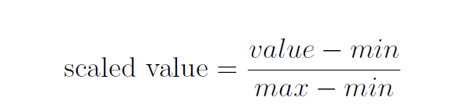

## Scale ML Data
1. Normalize the data
2. Standardize the data
3. When to use normalization vs. standardization

- Many ML algorithms expect the the data to be processed and scaled consistently, that is, the scale of the input and even the output to be equivalent. Just like when you are dealing with temperature, you have to be consistent of whether using Celsius or Fahrenheit, otherwise you will mess up what ever you're trying to do. 
- Scaled data also help us be able to weight the data, i.e. treating a data more important than other data value, for certain problems such as linear regression and logistic regression.
- The dataset will be use is: Pima Indian Diabetes Dataset

#### Normalized Data
- Normalization refers to different techniques depending on the context you're trying to solve. Here, it means rescaling all the (input) data value for each attribute (each column of data) back to a range between 0 and 1.
<br><br>
- Normalization requires knowing the minimum and maximum values for each attribute. You can get this info if you understand deeply about the data, or you will have to compute yourself by going through the loaded dataset.<br><br>
**Find min/max for each attribute (each column of dataset)**
```python
def dataset_minmax_column(dataset):
    minmax = []
    for i in range(len(dataset[0])):
        col_values = []
        for row in dataset:
            col_values.append(row[i])

        min_value = min(col_values)
        max_value = max(col_values)
        minmax.append([min_value, max_value])

    return minmax
```
- You go through a single attribute, i.e. column, of the dataset (by inner looping through every row of the data at that index `i` column) to get the entire data values from that column `i`. Get min and max values of that column and append them to a list.
- Continue to do so for every other attribute/column and you get a value pair of min and max of an attribute stored (in a 2D list).<br><br>
**Normalize data**
- Once we have max and min allowed values for each column computed and returned, we can normalize the raw data to the range 0-1 by very simply following the equation below:

```python
def normalize_dataset(dataset, minmax):
    for row in dataset:
        for i in range(len(row)):
            min_value, max_value = minmax[i]
            row[i] = (row[i] - min_value) / (max_value - min_value)
```
- Remember that `minmax` is a 2D list containing min/max values for each column. Therefore you loop through the columns for each row, get the corresponding min/max values for that column and normalize that data using the equation above.
- Combining with all of our previous functions of loading the data and converting data to float values and we obtain the result for 1st row of data:<br>
```Loaded data pima-indians-diabetes.data.csv with 768 rows and 9 columns.
Original Data: 
[[6.0, 148.0, 72.0, 35.0, 0.0, 33.6, 0.627, 50.0, 1.0]]
Min & Max:  [[0.0, 17.0], [0.0, 199.0], [0.0, 122.0], [0.0, 99.0], [0.0, 846.0], [0.0, 67.1], [0.078, 2.42], [21.0, 81.0], [0.0, 1.0]]
Normalized Data: 
[[0.35294117647058826, 0.7437185929648241, 0.5901639344262295, 0.35353535353535354, 0.0, 0.5007451564828614, 0.23441502988898377, 0.48333333333333334, 1.0]]
```

#### Standardize Data
- The technique of standardization means that you're rescaling the data so they center at around the value 0. In other word, you're centering the distribution of the data on the value 0 and the standard deviation to the value 1. Previously your raw data would be centered around its mean value and the standard deviation of 3.
- Together, the mean and standard deviation are used to summarized a normal distribution, that is the Gaussian distribution or bell curve (the distribution of data looks like a bell!). Therefore in order to rescale the data by standardization we have to get the mean and standard deviation of the raw data first.<br><br>
**Mean**
- Mean is basically average of all the value in your dataset. Here, we find the mean or average value for each of the attribute/column of the data. Follow the equation below:

```python
def means_column(dataset):
    means = []
    for i in range(len(dataset[0])):
        sum_column = 0
        for row in dataset:
            sum_column += row[i]

        means.append(sum_column / len(dataset))

    return means
```
- Simply go down through a single column to add up all the data value and get the average. Store it in a list and do so for the rest of the columns. By the end we have a list containing the mean/average value for every single column.<br><br>
**Standard Deviation**
- The standard deviation describes the spread of your data from the means. Simply code up the following equation:

```python
from math import sqrt

def stdev_column(dataset, means):
    stdevs = []
    for i in range(len(dataset[0])):
        variance = 0
        for row in dataset:
            variance += (row[i] - means[i])**2

        stdev = sqrt(variance / (len(dataset) - 1))
        stdevs.append(stdev)

    return stdevs
```
- Finally the standardized value is calculated by following the equation:

```python
def standardize_dataset(dataset, means, stdevs):
    for row in dataset:
        for i in range(len(dataset[0])):
            row[i] = (row[i] - means[i]) / stdevs[i]
```
- Just be aware of looping through every column for each row of data and get the corresponding values from the `means` and `stdevs` list to compute and rescale that data value.
- In the end we should get this for the 1st row of data:
```
Standardized Data:
[[0.6395304921176485, 0.8477713205896689, 0.14954329852954532, 0.9066790623472494, -0.6924393247241297, 0.20387990726747174, 0.4681868702297959, 1.4250667195933597, 1.3650063669598067]]

```
- All of our initial data is positive but since we're rescaling so they center around the value 0, the data value can now be negative as well!

#### What and when to use
- Use standardization if you know your data will form a normal distribution (by visualizing your data to see if it looks like a bell curve or not). For example, the GPA of COMP 1406 Z will definitely form a normal distribution that center around the mean value of somewhere in the 70s. All profs will aim their class's GPA toward this bell curve!
- Otherwise, use normalization. When you are weighing some input data value more important than the other, you can use normalization as well.


