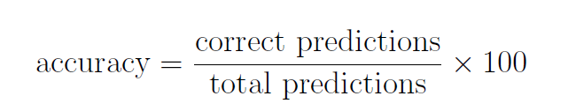
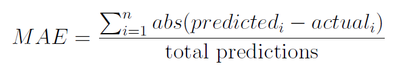
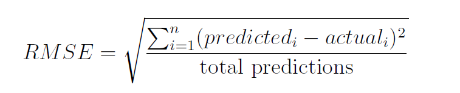

## Evaluation Metric
1. Classification Accuracy
2. Confusion Matrix
3. Mean Absolute Error (for Regression)
4. Root Mean Squared Error (for Regression)

After making predictions, you need to know if they are any good, that is, how close the predicted result is compared to actual result. There are 4 standard evaluation metrics to measure this as stated above. These metrics are used depending on the problem you are trying to solve:
- Classification problems: These problems ask you to predict a class/category from the given data, e.g. an email is spam or not spam (binary classification); an iris flower is of Iris-setosa, Iris-versicolor, Iris-virginica species; etc. ...
- Regression problems: You have to predict a numerical value from the given data, e.g. stock prediction; a student final GPA's based on his/her study habits, precious grades, personal/social background; etc. ...
<br><br>
Of course, you want to minimize the loss/error that these evaluation metrics compute from your model's predictions. Also, these metrics helps you in choosing among:
- Different data manipulations/resamplings used to train the ML model.
- Different ML models.
- Different configurations of a ML model.

#### Classification Accuracy
- This metric is for classification problem and it's the quickest, easiest way to evaluate the model's set of predictions.
- The result is in precentage ranging from 0% for worst possible accuracy to 100% for best possible accuracy, and is given by this simple, intuitive equation:

- Following the equation above and we have the following:
```python
def accuracy_metric(actual, predicted):
    correct = 0
    for i in range(len(actual)):            #or len(predicted)... whatever
        if actual[i] == predicted[i]:
            correct += 1

    return (correct / len(actual)) * 100
```
- The arguments we are given are a list of  the expected actual outputs (from your dataset) and a list of predicted outputs from your model. Each entry/element from the 2 lists corresponds to each other and corresponds to a row of data from the dataset.
- Again, we created a small contrived data to test our code:
```python
actual = [0,0,0,0,0,1,1,1,1,1]
predicted = [0,1,0,0,0,1,0,1,1,1]
accuracy = accuracy_metric(actual, predicted)
print("Accuracy metric: ", accuracy)
```
```Accuracy metric:  80.0```
<br><br>
- Accuracy is a simple, good metric to use have a small number of class values to predict, typically 2. But as the class values increase, the metric starts to loose it meanings as it doesn't give you any/much information about how well/bad  your model does.
<br><br>

#### Confusion Matrix
- When there are multiple classes to predict involve, you may want to see different perspectives on the result that your model made. A confusion matrix (which is pretty confusing to understand at first) provides a good summary of all the predictions made compared to the expected actual values. 
- The results are presented as counts (integer value) in each entry of the matrix. The rows represent actual class values and the columns represent predicted class values. Counts in each entry, therefore, represents how many **times** the model predict this specific class value when the actual class value is this.
- The model gives detail information as to which predictions were wrong and what the type of mistake is made. 
- A low-level implementation of the confusion matrix is below:
```python
def confusion_matrix(actual, predicted):
    unique_class = {}
    encode = 0
    for value in actual:                #get the unique class value only
        if value in unique_class:       #and encode them into integers
            continue
        unique_class[value] = encode
        encode += 1
    num_unique = len(unique_class)


    matrix = []
    for i in range(num_unique):         #creating rows
        matrix.append([])
    for i in range(num_unique):         #creating columns and initialise the entries.
        for j in range(num_unique):
            matrix[j].append(0)


    for i in range(len(actual)):        #count the prediction
        x = unique_class[actual[i]]
        y = unique_class[predicted[i]]
        matrix[x][y] += 1

    return unique_class, matrix
```
- We are given the same interface of arguments.
- We first get the unique class values and encode then to integer (when the class values are non-numerical), store then in dictionary for later use.
- We then initialise matrix with enough rows and columns correspond to the number of (unique) class values. The matrix, thus, is a square.
- We start filling the entries of the matrix. From the 2 argument lists we get the 2 corresponding class values, and the dictionary above then gives us the encoded values. Use these values to index into our matrix and count up the entry (how many times the actual & predicted value associate with each other).
- Return the encoded class values to see how they have been encoded, as well as the confusion matrix.
<br><br>
- We then nicely printed out these info with our small contrived dataset:
```python
actual_new =    [0,0,0,0,0,1,1,1,1,1]
predicted_new = [0,1,1,0,0,1,0,1,1,1]
class_val, mat = confusion_matrix(actual_new, predicted_new)
print("Class value encoding: ", class_val)
print("Confusion Matrix: ", mat)

def print_confusion_matrix(unique, matrix):
    keys = []
    print("   ", end="")
    for key in unique:
        print(key, end="  ")
        keys.append(key)
    print()
    for i in range(len(matrix[0])):
        print(keys[i], matrix[i])

print_confusion_matrix(class_val, mat)
```
```
Class value encoding:  {0: 0, 1: 1}
Confusion Matrix:  [[3, 2], [1, 4]]
   0  1  
0 [3, 2]
1 [1, 4]
```
- Keep in mind that the class values in vertical direction (in other word, the values corresponding to the horizontal rows) are the actual values. The other class values correspond to the predicted ones.
- The diagonal direction is where the model make correct predictions with 3 + 4 = 7 of them. We also see in the remaining other 2 entries where the model made errors (1 + 2 = 3 of them).
- These entries in fact has its own formal terms:
  - True Negative (0 vs. 0) and True Positive (1 vs. 1): These are the entries in the diagonal line of the matrix. They indicates that the model makes correct decision, that is, true is indeed true and false is indeed false.
  - False Negative (0-predicted vs. 1-actual): the model predicts the result is negative when the result is actually positive, e.g you are infected and positive to Corona virus when somehow you get tested and are said to be negative to the virus (dangerous!).
  - False Positive (1-predicted vs. 0-actual): the model predicts the result is positive when it's actually negative, e.g. you're diagnosed to have cancer but you actually don't have it (~ better to be safe than sorry!)


#### Mean Absolute Error
- The evaluation metric is for the regression problems where the model has to predict a real numerical values. 
- The metric is very easy and intuitive, which is compute all the errors/losses that the model has made (the difference between the predicted and the actual values) and take the average of them:

```python
def mae_metric(actual, predicted):
    sum_error = 0.0
    for i in range(len(actual)):
        sum_error += abs(actual[i] - predicted[i])

    return sum_error / float(len(actual))


actual = [0.1, 0.2, 0.3, 0.4, 0.5]
predicted = [0.11, 0.19, 0.29, 0.41, 0.5]
mae = mae_metric(actual, predicted)
print("Mean Absolute Error: ", mae)
```
- Tested on a small contrive data and we have:
```
Mean Absolute Error:  0.007999999999999993
```
- To understand the error/loss value that the metric has given us, notice from the contrive dataset that the predicted values are only off by 0.01 compared to its corresponding actual value (with the exception of the last column where it predicts correctly). Thus, we expect that the resulted error/loss should be around/less than 0.01.


#### Root Mean Squared Error
- This is another, very popular metric for regression problem and is defined by the following equation:

```python
from math import sqrt
def rmse_metric(actual, predicted):
    mse = 0.0
    for i in range(len(actual)):
        mse += (actual[i] - predicted[i])**2

    return sqrt(mse / len(predicted))

actual = [0.1, 0.2, 0.3, 0.4, 0.5]
predicted = [0.11, 0.19, 0.29, 0.41, 0.5]
rmse = rmse_metric(actual, predicted)
print("Root Mean Squared Error: ", rmse)
```
```
Root Mean Squared Error:  0.00894427190999915
```
- RMSE measures how spread out (i.e. the standard deviation) the prediction error is when comparing actual value vs. predicted. Just like standard deviation for a dataset (each value vs. mean of dataset), RMSE is the std deviation but for prediction error/loss.
- The higher the RMSE score is means that the prediction error is more spread out which also means a lot of predicted value is far from the actual value, which finally means it's bad!
- We have the same contrived data but a slightly different error/loss computed by 2 different metrics, and this is why RMSE is preferred over the MAE.
- We still expect the error to be close to 0.01, but the RMSR error is higher than the previous MAE result because RMSE penalizes larger errors with worse score, that is, the worse/further your prediction is from the actual output, then worse score you get. Mathematically, you can notice the squaring part in the equation that causes this to happen!

  
  