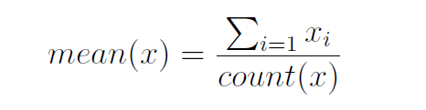

## Simple Linear Regression
1. Estimate statistical quantities from training data
2. Estimate linear regression coefficient from data
3. Make predictions using linear regression of new data

- Linear regression basically means you're trying to find a line of best fit among all the data values in the dataset, that is, a **linear** line that tries to hit or be as close to the data as possible. It's called **simple** linear regression because the line of best fit you're trying to find is simply just a straight line.
<br><br>
- From the definition and the name itself, you can guess it's for regression problems and there must be a linear relationship between the input variables (X) and the single corresponding output variable (Y).
<br><br>
- The linear regression curve is simply of the form:


- b1 and b0 are the coefficients we focus on and we'll try to estimate them by using some statistics on the training dataset. We'll compute statistical quantities such as mean, variance and covariance.
<br><br>
- Once we know these 2 coefficients, it becomes basic high school math where you're given the input values X (from the dataset), plug it into the equation and get the Y output value as our prediction!
<br><br>
- The algebra for b1 and b0 is given as equation below and what's left for us is to break it down and implement them:

<br><br>
- For our dataset, we'll continue to make small contrived data and assume that the dataset contains just 2 columns: first column contains the given values X and the last column contains the output values Y we're supposed to predict.

#### Calculate statistic quantities of the data
**Mean**


- The first thing we obviously need to implement is the mean/average of a given list of values (we'll need to find mean for both input & output values!)
```python
def mean(values):
    return sum(values) / len(values)
```

**Variance**
- Variance is a statistical quantity that is define roughly as below:


- Precisely, the actual formula for variance is the equation above divided by length of the dataset N. But later during our computation, the length N of the dataset will be cancel out therefore we don't implement this part.
- There's no precise definition for variance, other than the fact that it describes the relationship between each input value X vs. the mean/average of the dataset; but it is also used to compute the std deviation by taking the sqrt of variance!
```python
def variance(values, mean):
    tmp = []
    for value in values:
        tmp.append((value - mean)**2)

    return sum(tmp)
```
- We create a small contrived dataset to test our program:
```python
dataset = [[1, 1], [2, 3], [4, 3], [3, 2], [5, 5]]
x = [row[0] for row in dataset]
y = [row[1] for row in dataset]
mean_x, mean_y = mean(x), mean(y)
var_x, var_y = variance(x, mean_x), variance(y, mean_y)
print('x stats: mean = %.4f \tvariance = %.4f' % (mean_x, var_x))
print('y stats: mean = %.4f \tvariance = %.4f' % (mean_y, var_y))
```
```
x stats: mean = 3.0000 	variance = 10.0000
y stats: mean = 2.8000 	variance = 8.8000
```

**Covariance**
- Covariance is very much similar to variance in the sense that it is used to measure the relationship between input X and output Y, whereas variance is measuring relationship between the value X vs. the mean/average of dataset. 


- Again, the actual formula for covariance is the equation above divided by length of dataset N, but as we'll see it'll also be cancel out so we don't implement that part.
```python
def covariance(x, y, mean_x, mean_y):
    covar = 0.0
    for i in range(len(x)):     #or len(y)...whatever
        covar += (x[i] - mean_x) * (y[i] - mean_y)

    return covar
```
```
Covariance: 8.0000
```

#### Estimate Coefficients
- Notice that when we're trying to compute variance and covariance, we're actually working to compute the coefficient b1!


- From the old previous formula we now have a new shorter one:


- This formula makes more sense now since the coefficient b1 is the slope for our linear regression curve, and a slope of a line measures the relationship/rate of change between X and Y. By taking covariance divided by variance, we then get the single constant factor that describes how X is related to Y which is exactly the slope/coefficient b1 we want.
- Covariance is divided by variance and therefore the length of the dataset N in both formulas will be cancel as mentioned earlier!
```python
def coefficients(dataset):
    x = [row[0] for row in dataset]
    y = [row[1] for row in dataset]

    mean_x, mean_y = mean(x), mean(y)

    b1 = covariance(x, y, mean_x, mean_y) / variance(x, mean_x)
    b0 = mean_y - b1 * mean_x

    return b1, b0
```
```
Coefficients: b1 = 0.8000 	 b0 = 0.4000
```
- Because we know the dataset has only 2 columns, we separate them so we can apply the statistical quantities (mean, variance & covariance) on them.
- We also use Python dictionary comprehension to make the code shorter (1 line of code), but it is basically equivalent to a `for` loop and appending the value to the new list (which can take 3 lines).

#### Compute simple linear regression
- We have a function that computes the coefficients, and what's left is simply to call that function, use the simple linear equation to plug in the values and get the predictions!


```python
def simple_linear_regression(train, test):
    predictions = []
    b1, b0 = coefficients(train)

    for row in test:
        xhat = row[0]
        yhat = b0 + b1 * xhat
        predictions.append(yhat)

    return predictions
```
- The algorithm takes in training dataset and testing dataset. We compute the coefficients b0, b1 from the training dataset, then use it for the linear equation & make predictions on the testing dataset:
```
[1.1999999999999995, 1.9999999999999996, 3.5999999999999996, 2.8, 4.3999999999999995]
```

#### Evaluate
- We now ties back to what we have learned from previous sections:
  - call the algorithm to make the predictions
  - use the algorithm evaluation metric earlier to calculate the error/loss between the set of predictions vs. actual output values.

```python
from math import sqrt
def rmse_metric(actual, predicted):
    mse = 0.0
    for i in range(len(actual)):
        mse += (actual[i] - predicted[i])**2

    return sqrt(mse / len(predicted))
```
- RMSE is always the metric to go for with regression problem, and this is exactly the code we derive from previous section.
- We then have a wrapper (main) function that ties together the metric and algorithm and evaluate the result:
```python
def evaluate_alg(dataset, algorithm):
    test = []
    for row in dataset:
        data = row.copy()
        data[-1] = None
        test.append(data)

    predictions = algorithm(dataset, test)
    print(predictions)

    actual = [row[-1] for row in dataset]
    error = rmse_metric(actual, predictions)
    return error
```
- We pass in the `dataset` but we also pass in the `algorithm` function itself as argument! 
- We won't really separate the dataset into training and testing, just because our contrived dataset is very small. Instead, we will use the entire dataset to train the model/algorithm, and make a copy of the training dataset and call it our testing data!
- Use the `algorithm` function argument we passed in earlier to get the predictions, then call the RMSE metric to compute the error:
```
RMSE: 0.6928
```

